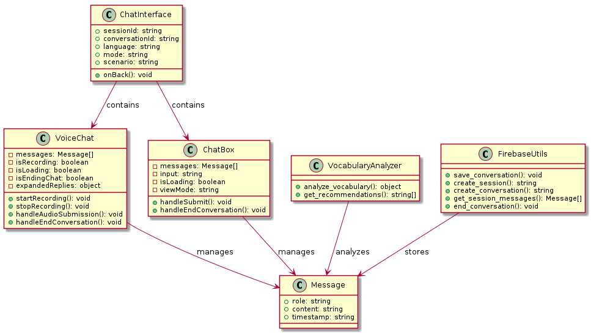
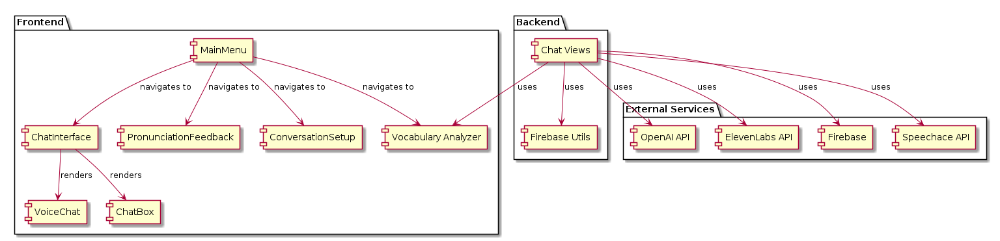
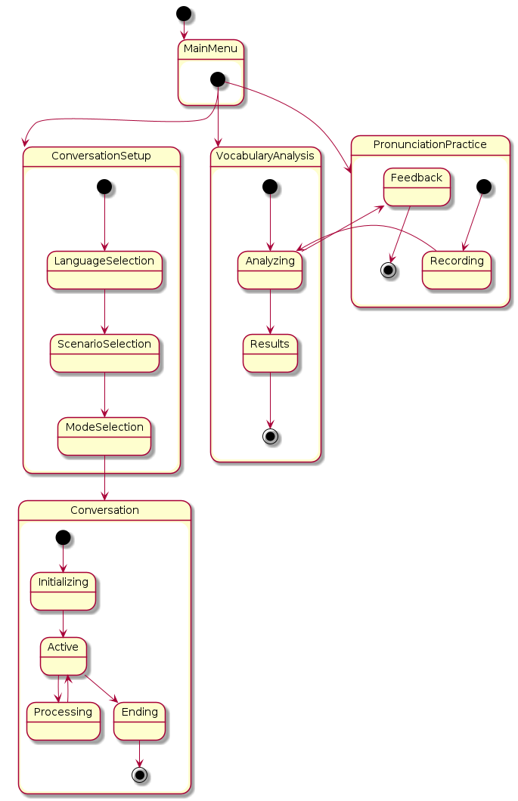
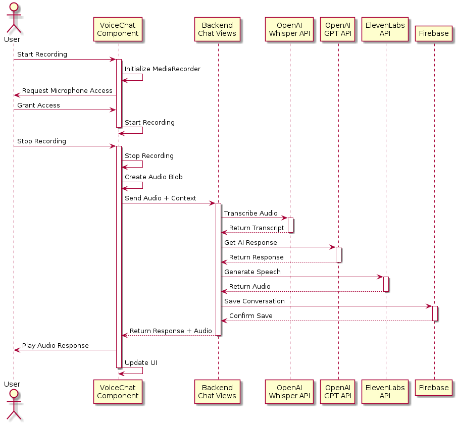

# DuolingoPlusPlus, AI-Powered Language Learning App

## Descriere Proiect:
Această aplicație web folosește în mod inteligent LLM-urile pentru a îmbunătăți învățarea limbilor străine. User-ul poate folosi platforma pentru a își îmbunătăți skill-urile in mai multe moduri:

1. **Scenarii Interactive cu AI (Text + Voce)**: Userul va interacționa cu AI într-o conversație (conversație text pentru spelling improvement, sau conversație audio), unde va primi feedback despre performanța sa după fiecare reply, dar și la sfârșitul conversației.
3. **AI Pronunciation Coach**: Utilizatorii vor citi propoziții, iar AI-ul va analiza pronunția și va oferi feedback pentru îmbunătățire.
4. **Vocabulary Recommendation System**: În funcție de cuvintele pe care le știe și le folosește cel mai frecvent în conversațiile cu AI, aplicația va recomanda vocabularul adițional ce ar trebui învățat. Metoda foarte bună si eficientă de a imbogăți vocabularul si a nu avea un limbaj repetitiv în limba străină.


## Accesibil pe:

<https://duolingo-plus-plus.onrender.com/>
Cu mentiunea ca server-ul isi da spin-down de la inactivitate, posibil sa dureze pana la un minut pana se incarca. De asemenea, tot ce tine de audio nu merge din cauza server-ului de deploy. (bugetul a mers pe token-uri la OpenAI, pe Render am ramas cu Free Usage Tier...)
---
## Tehnologii:

### Frontend:
- **React.js** - pentru construirea interfeței interactive a utilizatorului.

### Backend:
- **Python (Flask/Django)** - pentru logica server-side.

### Speech-to-Text & Text-to-Speech:
- **Whisper API** (OpenAI) sau pentru transcrierea audio.
- **ELEVENLABS** pentru generarea de voce.

### Database:
- **Firebase Firestore** - pentru stocarea datelor utilizatorului, inclusiv vocabularul învățat.

---
## Backlog
### 0. **Stabilirea tehnologiilor, familiarizarea cu acestea**:
- [X] **Cercetare** în privința tehnologiilor care se potrivesc cel mai bine proiectului si satisfac cerințele
- [X] **Alegerea** tehnologiilor și familiarizarea cu acestea.
- [X] **Delegarea** task-urilor în echipă.

### 1. **Scenarii de convesație interactive cu AI (Text + Voce)**:
- [X] **Cercetare** pentru a înțelege cerințele tehnice ale GPT-3.5 pentru integrarea conversației interactive.
- [X] **Creare API pentru interacțiune text**: Implementarea unui sistem simplu de conversație care poate răspunde la întrebări.
- [X] **Creare API pentru interacțiune vocală**: Integrarea **Whisper** și **Google TTS** pentru a suporta conversații vocale.
- [X] **Creare logica feedback**: Construirea unui sistem care să ofere feedback bazat pe conversație (corectitudinea gramaticală, relevanța răspunsurilor)
- [X] **Creare interfață front-end**: Dezvoltarea UI-ului pentru interacțiunea utilizatorului (chatbox, butoane pentru conversații vocale).
- [X] **Testare**: Testarea funcționalității conversației și integrarea feedback-ului

### 2. **AI Pronunciation Coach**:
- [X] **Cercetare și alegerea tehnologiei pentru Speech-to-Text**: Folosirea **Whisper** sau pentru analiza audio.
- [X] **Creare logică de feedback pentru pronunție**: Antrenarea unui model care să analizeze acuratețea pronunției (ex: utilizarea Wav2Vec).
- [X] **Creare API pentru pronunție**: Crearea unui endpoint care va analiza pronunția utilizatorului.
- [X] **Interfață front-end pentru pronunție**: Dezvoltarea unei interfețe prin care utilizatorul poate citi propoziții și primi feedback vocal.
- [X] **Testare**: Verificarea acurateței și preciziei în analiza pronunției.

### 3. **Vocabulary Recommendation System**:
- [X] **Creare model de recomandare vocabular**: Folosirea unui model LLM pentru a analiza vocabularul utilizatorului (primește cele mai frecvent folosite cuvinte și întoarce o lista de cuvinte asemănătoare semantic).
- [X] **Creare API de recomandare**: Construirea unui endpoint care va returna cuvintele recomandate pe baza vocabularului utilizatorului.
- [X] **Integrarea cu Firestore**: Stocarea vocabularului utilizatorului în Firebase Firestore pentru a personaliza recomandările.
- [X] **Creare interfață front-end**: Dezvoltarea UI-ului pentru a prezenta cuvintele recomandate și a le învăța.
- [X] **Testare**: Testarea funcționalității și acurateței recomandărilor.

### 4. **Interacțiune între componente**:
- [X] **Integrarea între scenarii interactive, pronunciation coach și vocabulary recommendation**: Crearea unui flux de utilizator în care toți pașii să fie legați într-un singur flux de învățare.
- [X] **Testare finală**: Testarea întregii aplicații pentru funcționarea corectă a interacțiunii între funcționalități.

### 5. **Optimizare și Scalable Design**:
- [X] **Optimizare performanță**: Asigurarea unui timp rapid de răspuns și implementarea unui design scalabil pentru a putea gestiona un număr mare de utilizatori simultan.

### 6. **Documentare și Raportare Bug-uri**:
- [X] **Documentația** specifică implementării funcționalităților aplicației, a folosirii toolurilor de AI.
- [X] **Documentația de prompt-engineering** folosit cu LLM-urile în dezvoltarea proiectului.
- [X] **Raportarea și rezolvarea bugurilor** pe măsură ce apar.

### 7. **Testare & Feedback utilizator**:
- [X] **Testare automată** din server-side (posibil si Github).
- [X] **Testare beta** cu un grup selectat de utilizatori (colegi, prieteni).
---
## Demo offline
[Duolingo-Plus-Plus demo](https://youtu.be/wJ8b0s0LWTc)
---

## User stories
1. Ca utilizator, vreau să folosesc o aplicație cât mai ușoară, eficientă și rapidă pentru a practica limba pe care o învăț.

2. Ca utilizator, vreau să primesc feedback despre corectitudinea gramaticală la sfârșitul unei conversații, astfel încât să-mi imbunătătesc abilitățile de comunicare.

3. Ca utilizator, vreau să dobandesc skill-uri conversaționale în limba pe care o studiez în mod cât mai eficient.

4. Ca utilizator, vreau să am posibilitatea de a-mi compara direct pronunția cu una nativă.

5. Ca utilizator, vreau să îmi dezvolt cât mai eficient vocabularul, folosind cuvinte cât mai potrivite scenariului în care ma aflu.

6. Ca utilizator, vreau să primesc recomandări de vocabular personalizate pe baza cuvintelor pe care le folosesc, astfel încât să îmbogățesc vocabularul meu cât mai ușor.

7. Ca utilizator, vreau să pot salva cuvintele pe care le învăț într-un vocabular personalizat, astfel încât să pot reveni la ele mai târziu.

8. Ca utilizator, vreau să pot interacționa cu AI prin voce, astfel încât să pot exersa ascultarea și vorbirea într-un mod natural.

9. Ca utilizator, vreau să pot selecta nivelul de dificultate al conversațiilor cu AI, astfel încât să încep de la un nivel de bază și să progresez treptat.

10. Ca utilizator, vreau să pot urmări progresul meu în învățarea limbii, astfel încât să știu ce cuvinte și concepte am învățat și ce trebuie să mai exersez.

---

## Diagrame 






---


## Prompt engineering

Documentatia pentru prompt engineering este foarte potrivita pentru proiectul nostru, deoarece folosim AI-uri atat pentru dezvoltarea aplicatiei web cat si inauntrul aplicatiei web, ideea proiectului fiind de a utiliza LLM-urile in mod cat mai eficient si mai pipelined pentru o invatare cat mai usoara si cat mai facila a unei limbi straine.

Pentru modelul folosit in /chat am ales ChatGPT, si anume `gpt-4-turbo`. Modelul primeste la fiecare request un system prompt, mesajul actual dat de user, impreuna cu contextul (istoricul mesajelor din conversatia actuala) si alti parametrii (limbaj/scenario) si intoarce un text structurat corect (asa cum a fost instruit in system prompt) cu reply-ul lui ca asistent in conversatia si cu feedback. Desigur ca intentia este ca reply-ul asistentului sa fie in limba selectata, iar feedback-ul sa fie mereu in engleza. Doar ca gpt-4-turbo nu respecta mereu ce ii spui in system prompt. Si tocmai aici vine partea de prompt engineering. Daca nu este mentionat clar in system prompt, modelul va intoarce cum isi doreste el: Uneori tot mesajul in limba straina, alteori poate corect. Daca este mentionat suficient de clar in system prompt, **modelul inca mai intoarce uneori feedback-ul in limba straina**. Dupa incercari de a rezolva aceasta problema cu prompt-engineering, am aflat ca nu este deloc eficient sa pui in prompt de mai multe ori la rand aceeasi instructiune ("Return the feedback in English. ... Make sure only the reply part is in {`language`}, the feedback part is natural English. ... Don't forget to use English language for feedback"). Metoda ineficienta pentru ca folosesti mai multi tokensi si pentru ca oricum inca mai are instante in care are comportament neasteptat. Solutia (cea mai buna pe care am gasit-o pana acum) pentru a preveni cat mai multe din aceste cazuri este de a pastra un sytem prompt scurt si concis, dar pentru care LLM-ul sa aiba cat mai putine surse in care sa fie cat mai putin loc pentru interpretarea libera a modelului. Am observat ca multe metode precum chain of thought sau formatarea raspunsului intoarce raspunsuri mai bine. De asemenea, trebuie eliminate instructiunile care sunt contradictorii (eg. "Be concise but provide detailed explanations").

Cand vine vorba de folosit LLM-urile pentru dezvoltare, marturisesc ca am avut prilejul, ca echipa, sa testam mai multe modele. Am inceput evident cu ChatGPT. Pentru intrebare simple, adaugat componente in React, scris o functie in Python pentru serverul Django, ChatGPT se descurca foarte bine cu orice prompt basic. Daca folosesti totusi un prompt mai explicit, cu instructiuni clare si detalii de implementare exacte, ChatGPT se descurca fascinant de bine. Din nou, problema pare a fi in locurile in care promptul poate fi interpretat in mai multe feluri. Problema a inceput in momentul in care pentru o eroare, o modificare sau un feature nou in proiect, ChatGPT are nevoie de context. Am inceput evident prin a-i copia toate fisierul de care are nevoie in prompt, pentru a avea o intelegere cat mai profunda asupra proiectului. Desigur ca este obositor, mai ales cand ai nevoie de context din mai multe fisiere. Pentru aceasta, am descoperit un tool foarte interesant, numit Gitingest care transforma orice Git repository intr-un simplu bloc (imens) de text pentru a da mai departe codebase-ul in LLM-ul folosit. Este si foarte usor de folosit, tot ce trebuie sa faci este sa schimbi 'hub' cu 'ingest' in orice URL de GitHub. Dar nici metoda aceasta nu este una de durata. Teoretic de fiecare data cand modifici repo-ul si realizezi ca ai nevoie din nou ne ajutor de la ChatGPT intr-o problema care necesita context amplu, trebuie sa ii dai din nou mii de linii de cod, ceea ce ingreuneaza foarte mult procesul pentru ca de multe ori duce la erori de la ChatGPT, care de multe ori mai si refuza sa raspunda (nu intoarce nicio eroare, doar intoarce un mesaj vid, absolut gol).

Am incercat apoi, sperand ca este o problema de la ChatGPT, si modelul Claude de la Anthropic, pentr a vedea daca este mai capabil in privinta contextului dat de proiect. Am observat ca intr-adevar, pare mai bun, si nu doar pe context, dar in general. Am primit raspunsuri mai nuantate si mai bine structurate pentru intrebarile complexe de programare, si parea sa retina contextul mai bine din conversatiile lungi, cu o memorie mai clasa a ceea ce discutasem anterior. De asemenea, pentru sfaturi legate de arhitectura sau best practices in cod, Claude chiar se dovedeste superior. (ca side-note, acest lucru m-a facut curios si am intrat intr-un rabbit hole legat de cum performanta modelelor de chat-gpt flucteaza semnificativ, sau chiar se degreadeaza constant de-a lungul timpului).

In sfarsit, am ajuns si sa incerc Cursor, pentru cea mai buna captare a contextului. Pe scurt, am ramas dezamagit. In aparente, mai mult context (si mult mai accesibil, datorita faptului ca ruleaza direct in IDE si are acces tot codebase-ului si a repository-ului) nu este intotdeauna mai bun. De multe ori, Cursor cauta raspunsuri in fisiere in care nu ar trebui sa caute, sau face modificari inutile in mai multe fisiere. Alta problema care s-a ivit prea des a fost ca era ignorat contextul si creat unul nou. De exemplu, pentru modificarea unui view care se folosea de Firestore, am avut si raspunsuri in care era creat un nou fisier cu `firebase_utils.py` in loc de a-l folosi pe cel vechi. Mai mult, am avut urmatoarea eroare care era cauzata de un fisier python care importa 2 functii cu acelasi nume:

```python
from xyz import same_function_name
from abc import same_function_name
```

Chiar daca problema pare a fi banala, Cursor a avut nevoie de 3 prompt-uri (in care a modificat multe lucruri fara sens) pentru a constientiza problema reala cu aceste importuri. Cursor se descurca foarte bine pe taskuri repetitive si poate ridica foarte mult productivitatea unei echipe, atat timp cat este folosit inteligent, doar ca in final, pare ca foarte mult context poate si dauna procesului de eficientizare al dezvoltarii software.


